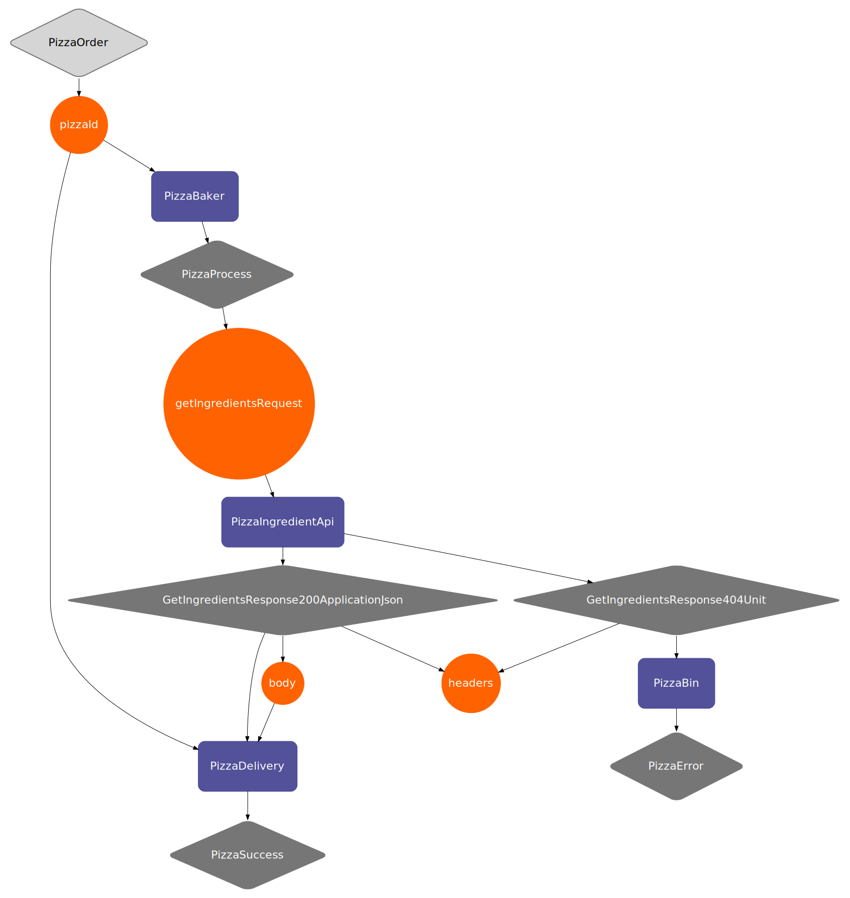

# Example project for integration of wirespec with baker

This project showcases how wirespec can be used in combination with baker. In this example the plugin that generates the code is disabled and the code is copied into the following file [GENERATED_CODE.kt](src%2Fmain%2Fkotlin%2Fcommunity%2Fflock%2Fwirespec%2Fbaker%2Fwirespecbaker%2FGENERATED_CODE.kt). The code is generated based on the [pizza.json](src%2Fmain%2Fopenapi%2Fpizza.json) file

## Visualize the graph

